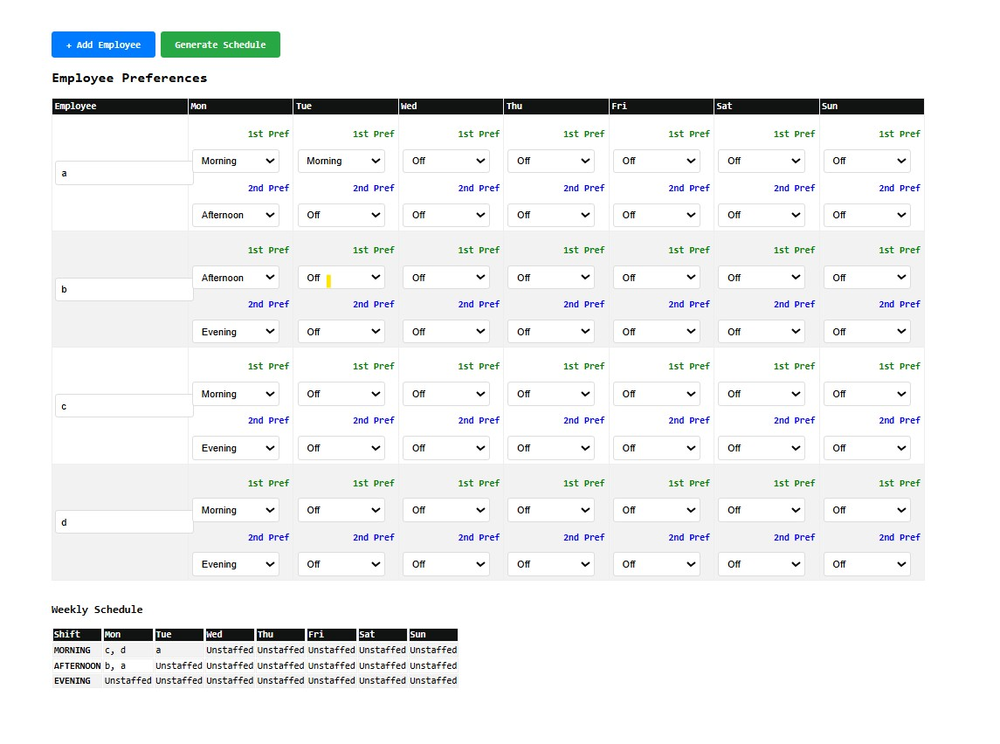

# Employee Shift Scheduler

A preference-based weekly shift scheduling system. Each employee submits their 1st and 2nd shift choice for every day of the week. The scheduler uses those preferences to build a fair weekly schedule, targeting 2 employees per shift.

---

# Screenshots



## How to Run
Open a terminal or command prompt in the project directory and run
```bash
start app.html
```

---

## The Preference Rule

Every employee must fill out preferences for **all 7 days** (5 days max (validation check)). Each day requires **exactly 2 choices** in this order:

```
[1st pref., 2nd pref.]
```

The available options for each choice are:

```
"morning"        → Morning shift
"afternoon"      → Afternoon shift
"evening"        → Evening shift
"Off"            → Cannot work
```

---

## Employee Data Structure

```javascript

{
  name: "A",          // Employee name
  workDayCount: 4,           //  days employee work per week (7-3)
  prefs: {          // Must include all 7 days
    Mon:["morning", "afternoon"],           // 1st: morning | 2nd: afternoon
    Tue:["Off", "Off"], // Blocked — cannot work
    Wed: ["evening", "afternoon"],           // 1st: evening | 2nd: afternoon
    Thu:["morning", "afternoon"],
    Fri:["afternoon", "morning"],
    Sat:["Off", "Off"],
    Sun:["Off", "Off"]
  }
}
```


## Preference Patterns

These are the common ways to set up each day's preferences depending on the situation.

### Block a day completely
Both choices are set to `"Off"`. The employee will never be scheduled on this day.

```javascript
Sat: ["Off", "Off"]
```

### Prefer one shift, open to another
The first item is what Employee want. The second is the backup the scheduler can fall back to.

```javascript
Mon: ["evening", "afternoon"]   // Wants evening, will accept afternoon
```

### Only willing to work one specific shift
Set both choices to the same shift. The scheduler will only assign them to that shift — nothing else.

```javascript
Wed: ["morning", "morning"]  // Morning only, no alternatives
```

### Open to a shift but nothing else on that day
Set the 2nd choice to `"Off"`. They can only be assigned the 1st choice; if that shift is full, they won't be scheduled that day.

```javascript
Tue: ["evening", "Off"]  // Evening or nothing
```

### Fully flexible
List two shifts in any order. The scheduler treats the first as preferred but will use either based on staffing needs.

```javascript
Thu: ["morning", "afternoon"]  // Either works fine
```

---

## Employee Type Examples

### Full-Time Worker (Mon–Fri, weekdays only)
```javascript
{
  name: "A",
  workDayCount: 5,
  preferences: {
    Mon:    ["morning", "afternoon"],
    Tue:   ["morning", "afternoon"],
    Wed: ["morning", "afternoon"],
    Thu:  ["morning", "afternoon"],
    Fri:    ["morning", "afternoon"],
    Sat:  ["Off", "Off"],
    Sun:    ["Off", "Off"]
  }
}
//Although 7 days , Employee are only allowed to work 5 days max(Validation check).
 


```


### Part-Time (Specific Days Only)
Only works Tuesday and Thursday afternoons.

```javascript
{
  name: "B",
  workDayCount: 2,        // only working 2 days
  preferences: {
    Mon:    ["Off", "Off"],
    Tue:   ["afternoon", "morning"],
    Wed: ["Off", "Off"],
    Thu:  ["afternoon", "morning"],
    Fri:    ["Off", "Off"],
    Sat:  ["Off", "Off"],
    Sun:    ["Off", "Off"]
  }
}
```

---

## How the Scheduler Assigns Shifts

For each shift on each day, the scheduler runs through these steps in order.

**Step 1(Filter).** Remove anyone who is not eligible:
- Already assigned to a different shift on that same day
- Already hit their `maxShifts` limit for the week
- Did not list this shift as their 1st or 2nd choice
- Marked the day as `"Off"`

**Step 2(Sort).** Rank the remaining eligible employees:
- **Preference rank**. Anyone who listed this shift as their 1st choice is ranked above someone who listed it as 2nd choice.
- **Workload fairness**. If two employees have the same preference rank, the one with fewer total shifts assigned so far wins.

**Step 3(Assign).** Take the top 2 from the sorted list and assign them to this shift. Update their records so they aren't scheduled again on the same day.


### Worked Example

Suppose the scheduler is filling **Monday morning** and four employees are eligible:

| Employee | Monday Preference | Rank for Morning | Shifts So Far |
|---|---|---|---|
| A | `["morning", "afternoon"]` | 0 (1st choice) | 2 |
| B | `["afternoon", "morning"]` | 1 (2nd choice) | 1 |
| C | `["morning", "evening"]` | 0 (1st choice) | 1 |
| D | `["morning", "evening"]` | 0 (1st choice) | 1 |


A, C and D have morning as 1st pref., so they sort ahead of B.
Between A, C and D,
     C and D has fewer shifts (1, 1 vs 2), so C and D is ranked first.

     Output:
| Shift | Monday  |  |
|---|---|--|
| morning | C,D  | C and D will work in monday morning|
| afternoon | B,A  | B and A will work in monday afternoon
|evening |unstaffed| nobody working in the evening but  outcome will be different if A shift was ['morning', 'evening'] => A would be working here(evening) and only B would be working afternoon.


